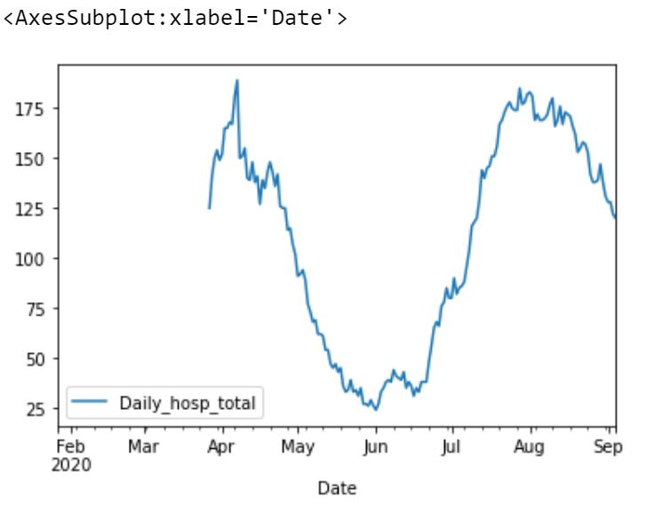
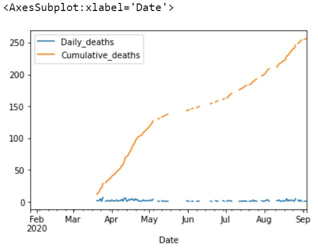
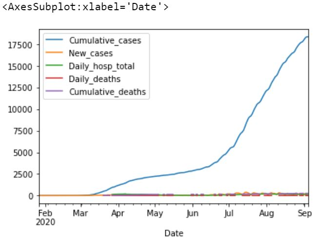
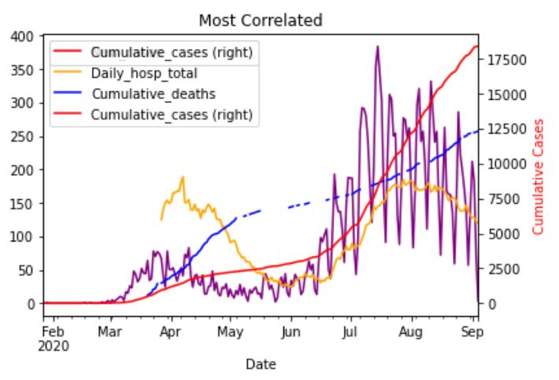

##  COVID-19 Data Analysis using Python
Data Analysis is the first step towards getting an insight into a data set. I have used **Jupyter Notebook** to write the **Python** code and used few powerful libraries to  extract useful information from the data. 

    > import pandas 
    > import numpy 
    > from numpy.fft import rfft, rfftfreq 
    > from datetime import timedelta 
    > import matplotlib.pyplot

Once the data has been acquired and processed (**cleaned** and **deduplicated**), the next step in the data analysis cycle is exploratory data analysis which kicks off with **visualization** of the data. 
###  Loading the data
The data sets I am using are based on data as of Sep. 2020 from County of Santa Clara open data portal. The next part of the code deals with loading the .csv data to our project.

    > hospitalizations = pd.read_csv("./hospitalizations.csv",index_col = "Date")
    > hosps = pd.read_csv("./COVID-19_hospitalizations_by_date.csv",index_col = "Date")
    > deaths = pd.read_csv("./Count_of_deaths_with_COVID-19_by_date.csv",index_col = "Date")
    > cases = pd.read_csv("./COVID-19_case_counts_by_date.csv",index_col = "Date")

###  Preprocessing the data
After the data sets loaded successfully, the next step is to preprocess the data before using it for plotting.

 - Drop non-interested columns
 - Remove duplicate or irrelevant observations
 - Fix structural errors
 - Filter unwanted outliers
 - Handle missing data
 - Validate

### Ploting 
After processing data, we can plot with data and look into the insight of the dataset.
Following showing some of the plotted figures from the data sets. 

    hosps = hosps.reindex(cases.index) # Reindex so that the datasets have the same index.
	hosps.plot()
	

    deaths = deaths.reindex(cases.index)
	deaths.plot()
	

 

    cases = cases.join([hosps, deaths])
    cases.plot()
	

`Plotting Most Correlated Covid Data`

